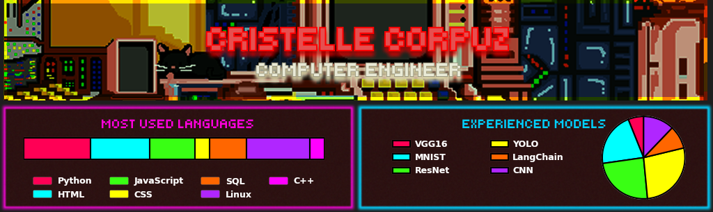

  
 

---

### 👩‍💻 About Me
Hi, I'm Cassy! I am an AI/ML Engineer who thrives on challenges. I am deeply passionate about artificial intelligence, data operations, and building ML with purpose. 

* 🔭 **Currently working on:** Leveling up my skills and enhancing my portfolio.
* 🌱 **Currently learning:** Expanding my solid foundation in Large Language Models (LLMs) and exploring LangChain. I am also learning more about AWS.
* ⚡ **Fun fact:** I built the dynamic pixel-art stats banner above entirely from scratch using Python and Matplotlib! Oh, and when I'm not debugging, I'm usually hanging out with my cat.

---

### 🛠️ Tools & Tech
* **AI/ML & Deep Learning:** PyTorch, ResNet, YOLO (v5, v9), CNNs, VGG16, MNIST, LangChain
* **Languages & Scripting:** Python (Highly Proficient), SQL, C++, JavaScript, HTML/CSS
* **Environment & OS:** Linux, Jupyter, VS Code, JSON

---

### 📫 How to Reach Me
I am always open to discussing AI engineering roles, data operations, or exciting tech challenges. 

* **LinkedIn:** [cristelle-corpuz](https://www.linkedin.com/in/cristelle-corpuz-158065205/)
* **Email:** [cristelle.csc@gmail.com](mailto:cristelle.csc@gmail.com)

---
